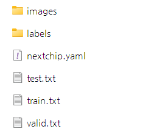
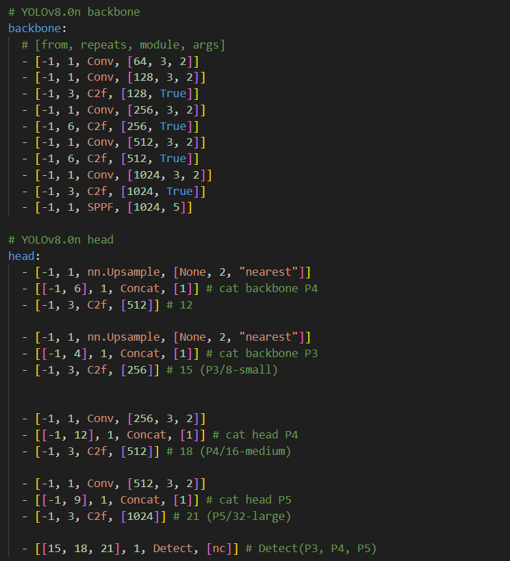
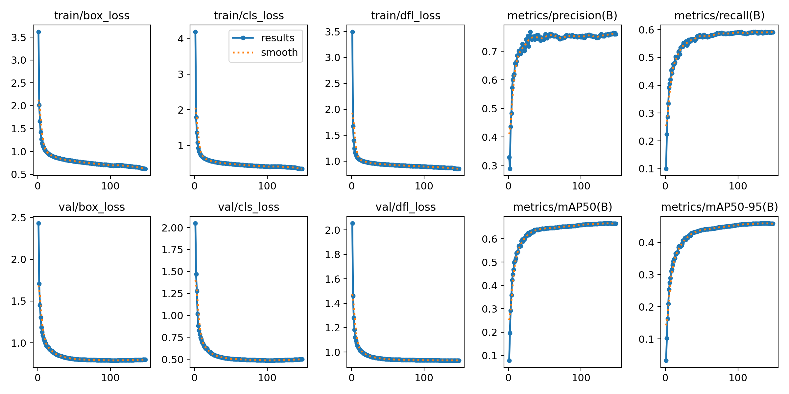
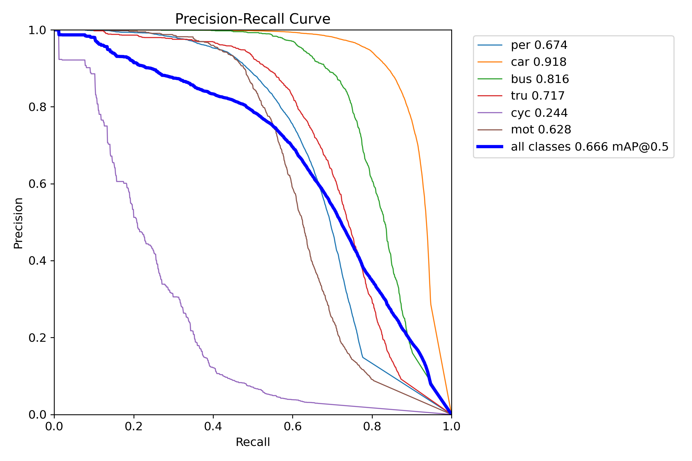
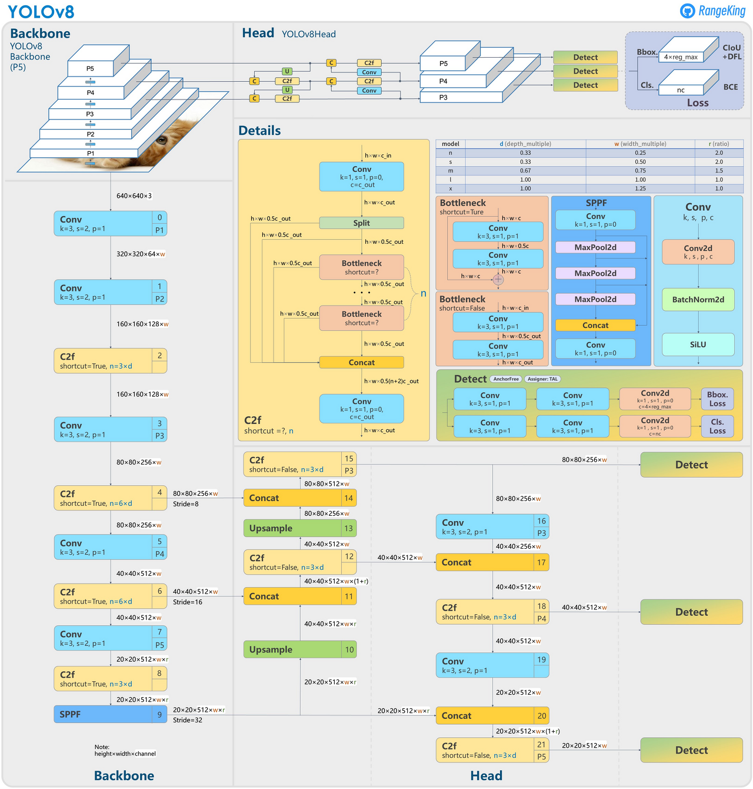
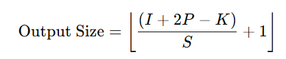
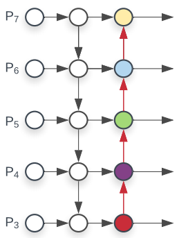

# AI반도체 기술인재 선발대회
주최 : 과학기술정보통신부 <br> 주관: 한국정보통신진흥협회(KAIT) <br> 참가 분야 : 모바일/엣지 <br> 참여 기업 : Nextchip <br> 기간: 2024-09-10 ~ 2024-12-03 <br> **`주제 : YOLO 모델 최적화 및 NPU 모델 탑재`**


## 모델 학습 프로세스
### 1. 데이터셋
Nextchip사에서 제공받은 train, valid, test set 사용



### 2. 선정 모델
- YOLOv8s
    > YOLO 모델 아키텍처는 크게 Backbone, Neck, Head 3가지로 나뉜다.
    > - Backbone : 입력 이미지로부터 특성(Feature)을 추출하는 역할
    > - Neck : 이미지로부터 추출된 여러 크기의 특성(Feature)들을 결합하는 역할
    > - Head : Feature들을 바탕으로 Object의 위치를 찾는 역할

- 모델 네트워크 아키텍처
    

### 3. 최종 모델 학습
- 학습 방법
    - [Ultralytics](https://github.com/ultralytics/ultralytics)의 YOLOv8으로 모델 학습 <br>
    -> (모델 구조가 선언되어 있는 yaml 파일을 수정해가며 학습을 진행하기 위해 github에서 Ultralytics를 clone 받아서 사용) <br>

- Hyperparameter
    ```
    epochs=150 <br>
    save_period=5 <br>
    batch=32 <br>
    patience=8 <br>
    optimizer=auto(SGD) <br>
    lr0=0.01 <br>
    momentum=0.9 <br>
    ```

- 학습 코드
    ```python
    import sys
    sys.path.append('/github/Ultralytics/path')
    from ult import ultralytics
    from ultralytics import YOLO

    model_path = "/model_architecture/yaml_file/path"
    
    model = YOLO(model_path)
    model.train(
        data="/dataset/yaml_file/path",
        exist_ok=exist_ok,
        epochs=ep,
        save_period=save_period,
        batch=batch,
        project=result_dir,
        name=name.split('.')[0],
        patience=patience
    )
    ```

### 4. 학습 결과
- loss graph
    

- PR Curve
    


## 모델 Architecture 분석
### Model Architecture


- **Backbone**<br>
    백본은 Conv 모듈과 C2f 모듈로 구성되어 있는 Top-down 형식이다.<br>
    640x640 size 이미지가 처음 Input으로 들어온다.<br>
    <u>**Conv**</u> 모듈은 합성곱 연산으로 Image에서 특징 추출과 다운샘플링 역할을 한다.<br>
    이때, Conv 모듈의 kernel, stride, padding의 값이 3, 2, 1이기 때문에 output size는 다음 공식과 같이 계산된다.<br>

    <br>
    > I : Input size<br>
    > K : Kernel size<br>
    > S : Stride<br>
    > P : Padding
    
    줄어든 Image는 C2f 모듈을 지나 더 많은 특징을 추출한다.<br>
    <u>**C2f**</u> 모듈은 Image의 정보를 유지하면서 Bottleneck을 통해 특징 강화와 정보를 병합하는 역할을 한다.<br>
    각 모듈을 지나 Image size는 20x20까지 Downsampling 된다.<br>
    80x80, 40x40, 20x20 size의 Layer는 각각 P3, P2, P1 이라고 부르게 된다.<br>
    Backbone의 마지막 SPPF Layer를 거치면서 다중 스케일 특징 추출을 통해 모델이 다양한 객체 크기에 대해 높은 성능을 발휘하도록 한다.<br>

- **Neck**<br>
    넥은 백본에서 추출한 특징들을 결합하는 역할을 하며 다음과 같은 PANet 형식이다.<br>
    
    <br>
    
    20x20 size의 이미지를 하나는 Detect단 앞으로 보내고 하나는 Upsampling한다.<br>
    Upsampling한 이미지는 40x40 size 이미지와 Concatenation하여 Feature 정보를 합친다.<br>
    80x80 size 이미지도 이러한 과정을 거친다.<br>
    80x80 size 이미지는 C2f 모듈을 거쳐 하나는 Head로 보내기 위해 Detect 모듈로 보내고 하나는 Conv 모듈을 거쳐 Downsampling하여 40x40 size 이미지와 Concatenation한다.<br>
    40x40, 20x20 size 이미지도 동일한 과정을 거친다.<br>
    다만 Neck에서의 C2f 모듈의 인자로 `shortcut=False`를 주기 때문에 `skip connection`이 적용되지 않는다. (Bottleneck X)

- **Head**<br>
    헤드는 넥에서 조합한 Feature를 받아 Object의 위치와 Class를 예측한다.<br>
    BBox(Bounding Box) Loss를 구할 때 2번의 Conv 모듈과 torch.nn.Conv2d 모듈을 한번 거친다.<br>
    이때 `c = 4 * reg_max` Bounding Box의 좌표를 주어 BBox 좌표를 예측한다.<br>
    Class Loss를 구할 때도 마찬가지로 동일한 과정을 거치고 `c = nc`로 클래스 개수를 주어 클래스를 예측한다.<br>

    