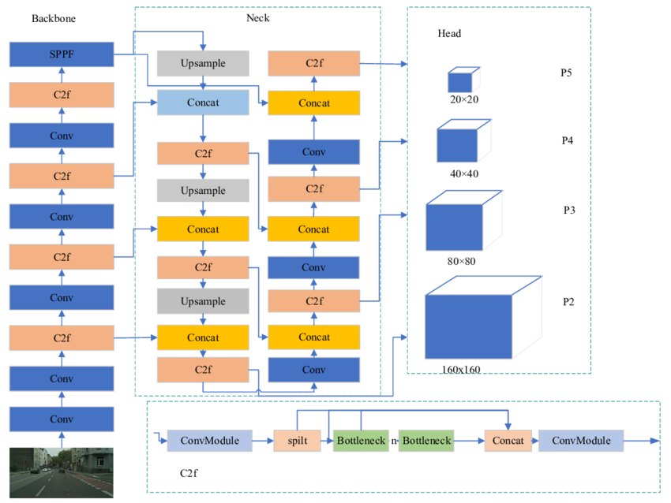
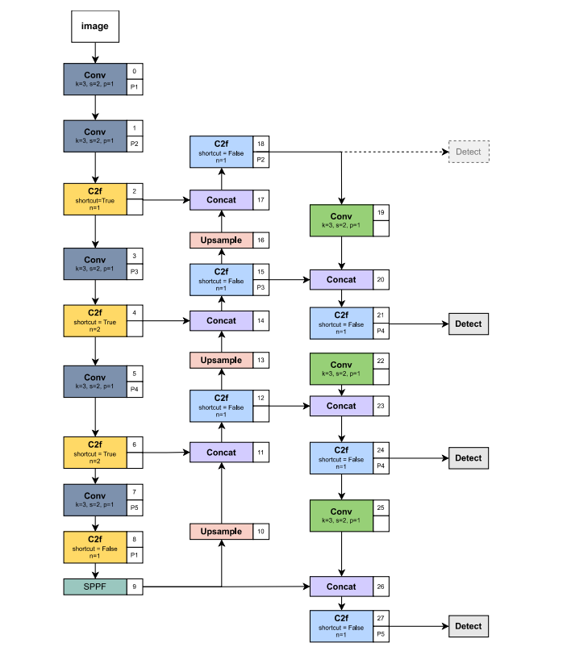
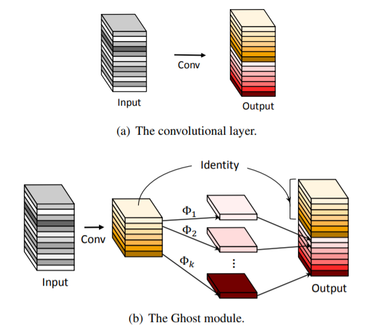
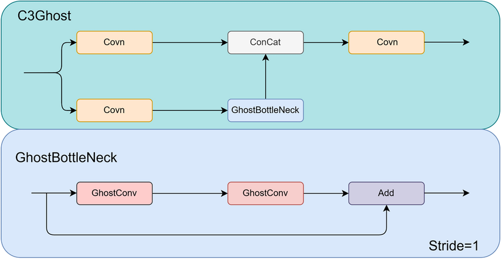

# AI반도체 기술인재 선발대회
주최 : 과학기술정보통신부 <br>
주관: 한국정보통신진흥협회(KAIT) <br>
참가 분야 : 모바일/엣지 <br>
참여 기업 : Nextchip <br>
기간: 2024-09-10 ~ 2024-12-03 <br>
**`주제 : YOLO 모델 최적화 및 NPU 모델 탑재`** <br>
조건 : Inference time 20ms 이내


## 모델 학습 프로세스
### 1. 데이터셋
Nextchip사에서 제공받은 train, valid, test set 사용


### 2. 선정 모델
- YOLOv8s
    > YOLO 모델 아키텍처는 크게 Backbone, Neck, Head 3가지로 나뉜다.
    > - Backbone : 입력 이미지로부터 특성(Feature)을 추출하는 역할
    > - Neck : 이미지로부터 추출된 여러 크기의 특성(Feature)들을 결합하는 역할
    > - Head : Feature들을 바탕으로 Object의 위치를 찾는 역할

- 모델 네트워크 아키텍처
    

### 3. 최종 모델 학습
- 학습 방법
    - [Ultralytics](https://github.com/ultralytics/ultralytics)의 YOLOv8으로 모델 학습 <br>
    -> (모델 구조가 선언되어 있는 yaml 파일을 수정해가며 학습을 진행하기 위해 github에서 Ultralytics를 clone 받아서 사용) <br>

- Hyperparameter
    ```
    epochs=150 <br>
    save_period=5 <br>
    batch=32 <br>
    patience=8 <br>
    optimizer=auto(SGD) <br>
    lr0=0.01 <br>
    momentum=0.9 <br>
    ```

- 학습 코드
    ```python
    import sys
    sys.path.append('/github/Ultralytics/path')
    from ult import ultralytics
    from ultralytics import YOLO

    model_path = "/model_architecture/yaml_file/path"
    
    model = YOLO(model_path)
    model.train(
        data="/dataset/yaml_file/path",
        exist_ok=exist_ok,
        epochs=ep,
        save_period=save_period,
        batch=batch,
        project=result_dir,
        name=name.split('.')[0],
        patience=patience
    )
    ```

### 4. 학습 결과
- loss graph
    

- PR Curve
    


## 모델 Architecture 분석
### Model Architecture


- **Backbone**<br>
    백본은 Conv 모듈과 C2f 모듈로 구성되어 있는 Top-down 형식이다.<br>
    640x640 size 이미지가 처음 Input으로 들어온다.<br>
    <u>**Conv**</u> 모듈은 합성곱 연산으로 Image에서 특징 추출과 다운샘플링 역할을 한다.<br>
    이때, Conv 모듈의 kernel, stride, padding의 값이 3, 2, 1이기 때문에 output size는 다음 공식과 같이 계산된다.<br>

    <br>
    > I : Input size<br>
    > K : Kernel size<br>
    > S : Stride<br>
    > P : Padding
    
    줄어든 Image는 C2f 모듈을 지나 더 많은 특징을 추출한다.<br>
    <u>**C2f**</u> 모듈은 Image의 정보를 유지하면서 Bottleneck을 통해 특징 강화와 정보를 병합하는 역할을 한다.<br>
    각 모듈을 지나 Image size는 20x20까지 Downsampling 된다.<br>
    80x80, 40x40, 20x20 size의 Layer는 각각 P3, P2, P1 이라고 부르게 된다.<br>
    Backbone의 마지막 SPPF Layer를 거치면서 다중 스케일 특징 추출을 통해 모델이 다양한 객체 크기에 대해 높은 성능을 발휘하도록 한다.<br>

- **Neck**<br>
    넥은 백본에서 추출한 특징들을 결합하는 역할을 하며 다음과 같은 PANet 형식이다.<br>
    
    <br>
    
    20x20 size의 이미지를 하나는 Detect단 앞으로 보내고 하나는 Upsampling한다.<br>
    Upsampling한 이미지는 40x40 size 이미지와 Concatenation하여 Feature 정보를 합친다.<br>
    80x80 size 이미지도 이러한 과정을 거친다.<br>
    80x80 size 이미지는 C2f 모듈을 거쳐 하나는 Head로 보내기 위해 Detect 모듈로 보내고 하나는 Conv 모듈을 거쳐 Downsampling하여 40x40 size 이미지와 Concatenation한다.<br>
    40x40, 20x20 size 이미지도 동일한 과정을 거친다.<br>
    다만 Neck에서의 C2f 모듈의 인자로 `shortcut=False`를 주기 때문에 `skip connection`이 적용되지 않는다. (Bottleneck X)

- **Head**<br>
    헤드는 넥에서 조합한 Feature를 받아 Object의 위치와 Class를 예측한다.<br>
    BBox(Bounding Box) Loss를 구할 때 2번의 Conv 모듈과 torch.nn.Conv2d 모듈을 한번 거친다.<br>
    이때 `c = 4 * reg_max` Bounding Box의 좌표로 BBox 좌표를 예측한다.<br>
    Class Loss를 구할 때도 마찬가지로 동일한 과정을 거치고 `c = nc` 클래스의 개수로 클래스를 예측한다.<br>


### 기존 YOLO Model의 문제점
- 소형 객체에 대한 탐지 성능이 그리 좋지 않다.
- Head는 Default로 `80x80`, `40x40`, `20x20` 3개로 고정되어 있다.
    - P1~P5 단으로 이루어져 있는데 `P1`에 가까울수록 소형 객체에 대한 정보를 많이 담고 있다.
    - `P5`에 가까울수록 대형 객체에 대한 정보를 많이 담고 있다.<br>


## 실험 설정
### 가설 1
```
P2 Layer를 추가하여 Detect단으로 내보내면 소형 객체에 대한 성능 탐지를 개선할 수 있을 것이다.
```



위 그림과 같이 아키텍처를 구성하면 160x160부터 20x20 사이즈의 이미지에서 뽑아내는 다양한 크기의 정보가 존재하기 때문에 소형 객체에 대한 성능 탐지 또한 개선할 수 있을 것이라고 생각함.

### 한계점
제공받은 NPU H/W가 P3 ~ P5 Layer의 Head로 고정되어 있는 제약 사항으로 인해 P2 Layer를 추가하여 Head로 내보내는 시도는 불가능함.

### <u>모델 네트워크 수정 전략 1</u>
P2단의 Layer에서는 160x160 사이즈의 이미지를 통해 소형 객체에 대한 정보를 다량 보유하고 있기 때문에 Head로 내보내지 않더라도 Neck 부분에서 정보를 합치면 성능이 오르지 않을까 하는 아이디어가 떠오름.



위 그림과 같이 P2 layer를 추가하여 Head로 내보내지 않고 P3단에 Concatenation하여 소형 객체에 대해 더 많은 정보를 담은 P3를 Head로 내보낸다.
P2 Layer를 추가한 모델명을 `v8s_p2`라고 한다.

### 결과 비교
| 성능 | v8s_org | v8s_p2 |
|------------|----------------|---------------|
| GPU mAP    | 63.49 | <mark>64.96</mark> |
| NPU mAP    | 53.29 | <mark>57.89</mark> |
| FPS        | 59.11 | <mark>51.03</mark> |

GPU 성능은 1.47으로 소폭 증가했지만 NPU 성능은 4.6 증가함을 확인할 수 있다.<br>
하지만 대회 조건인 Inference time이 20ms 이내, 즉 50FPS 이상을 보여야하기 때문에 모듈을 추가하기에는 무리라고 판단됐다.<br>
때문에 NPU 성능을 최대한 유지하되 <u>경량화</u>를 진행하여 추론 속도를 높이는 것에 목적을 두었다.

---
### 가설 2
`YOLOv8s 모델은 Conv 모듈과 C2f 모듈로 이루어져 있는데 이 모듈들을 경량화하면 추론 속도를 개선할 수 있을 것이다.`

### <u>모델 네트워크 수정 전략 2</u>
Backbone은 특징을 추출하는 중요한 부분이므로 유지한 채 Neck에 경량화를 시도한다.<br>
이 때 모듈을 Conv -> GhostConv / C2f -> C3Ghost로 대체한다.
- GhostConv

    

    - 2번의 Conv 모듈을 타고 나온다.
    - 첫번째 Conv 모듈을 통해 절반 채널의 output이 생성된다.
    - 첫번째 Conv 모듈의 output에 대해 두번째 Conv 모듈을 적용하여 간단한 feature를 추출하고 Input channel과 동일한 출력 채널의 output이 생성된다.
        - 이 때, kernel size는 5로 두고 groups는 Input Channel과 동일하게 주어 Depthwise Convolution 연산을 진행한다.
    - 두 ouptut에 대해 채널 단위로 Concatenation 한다.

- C3Ghost

    

    - C3 모듈과 동일하고 Bottleneck을 GhostBottleneck으로 대체했다.
    - GhostBottleneck 모듈은 GhostConv 모듈을 2번 사용한 Residual 형태로 연산된다.
    - GhostBottleneck 내에서 GhostConv를 사용하므로 기존 Bottleneck 모듈의 Conv 연산에 비해 연산량이 감소된다.

### 결과 비교
`v8s_P2의 Neck 부분에 GhostConv, C3Ghost 모듈을 적용한 모델명을 v8s_p2_gc_c3g 라고 한다.`
| 성능 | v8s_org | v8s_p2 | v8s_p2_gc_c3g |
|------------|------------|----------------|---------------|
| GPU mAP    | 63.49 | 64.96 | <mark>62.69</mark> |
| NPU mAP    | 53.29 | 57.89 | <mark>56.84</mark> |
| FPS        | 59.11 | 51.03 | <mark>55.99</mark> |

GPU 성능은 세 모델 중 가장 낮게 나왔지만 NPU 성능은 v8s_p2 모델에 비해 1.05로 소폭 감소했다.<br>
반면 **FPS**에서 <u>4.6</u> 증가했기 때문에 경량화에 성공함을 확인할 수 있다.

---
### 가설 3
`Backbone의 C2f 모듈에서 Bottleneck 반복 횟수를 결정하는 n값을 늘리면 성능이 개선할 것이다.`

### <u>모델 네트워크 수정 전략 3</u>
기존 YOLOv8 모델의 구조에서 Backbone의 C2f 모듈은 Bottleneck의 반복 횟수를 결정하는 중요한 요소 중 하나다. 이 반복 횟수는 `n` 값에 따라 설정되며, 기본적으로 (3, 6, 6, 3)으로 정의되어 있다.
특히, YOLOv8의 s 모델에서는 이 `n` 값이 `n x d` 형태로 계산된다. 여기서 `d`는 0.33으로 고정되어 있으며, 계산된 결과는 반올림하여 최종 반복 횟수로 사용된다.<br>
예를 들어, `n` 값이 3이라면 `3 x 0.33 = 0.99`가 되고, 이를 반올림한 값인 1이 실제 반복 횟수가 된다.<br>
이러한 방식은 모델의 경량화를 위해 설계된 구조적인 특징 중 하나다.<br>

### 결과 비교
`P2 Layer를 추가한 후 경량화한 모델을 기준으로 비교한다.`
| 성능 | v8s_p2_1221_gc_c3g | v8s_p2_2221_gc_c3g | v8s_p2_2211_gc_c3g | 
|------|------|------|------|
| GPU mAP    | 62.69 | 65.56 | <mark>65.72</mark> |
| NPU mAP    | 56.84 | 55.95 | <mark>57.24</mark> |
| FPS        | 55.99 | 52.67 | <mark>54.67</mark> |

Bottleneck 반복 횟수를 1221에서 2221로 늘렸을 때 NPU 성능은 감소한 것을 확인할 수 있었다.<br>
하지만 2211로 수정했을 때 NPU 측면에서 가장 높은것을 확인할 수 있었다.<br>
v8s_p2 모델을 기준으로 [1221, 2221, 3221, 4221] 비교했을 때는 2221이 가장 높은 성능을 보였다.<br>
이를 통해서 단순히 Bottleneck의 반복 횟수를 늘린다고 모델의 성능 또한 증가하지 않는다는 것을 확인할 수 있었다.<br>
v8s_p2_2221, v8s_p2_2211_gc_c3g 모델과 같이 P2~P5 어느 한곳의 반복율을 크게 높이는 것이 아닌 균형에 맞게 반복 횟수를 주어야 한다는 결론이 도출되었다.<br>
또한 P2~P5 Layer 전체에 너무 많은 Bottleneck 반복 횟수를 주면 양자화 과정에서 발생하는 손실이 커지기 때문에 적당한 양의 반복 수를 주어 최적화해야 한다는 생각도 들었다.<br>

